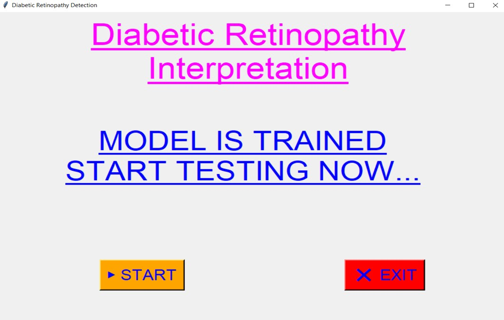
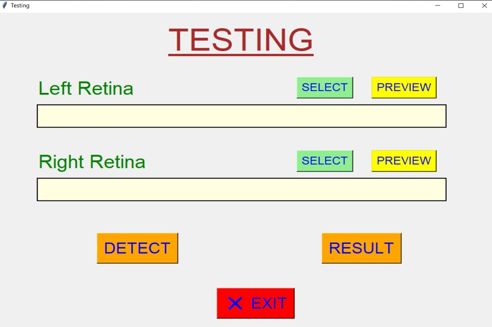
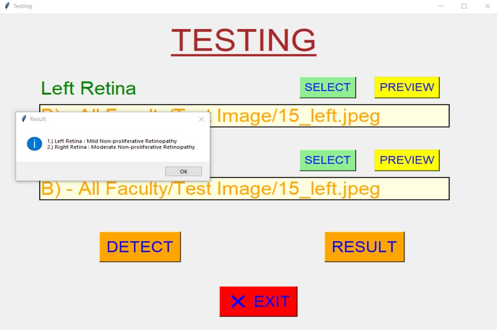
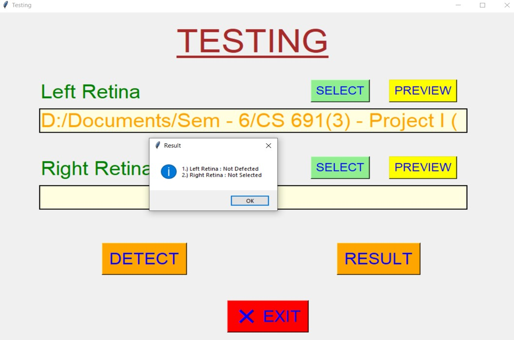
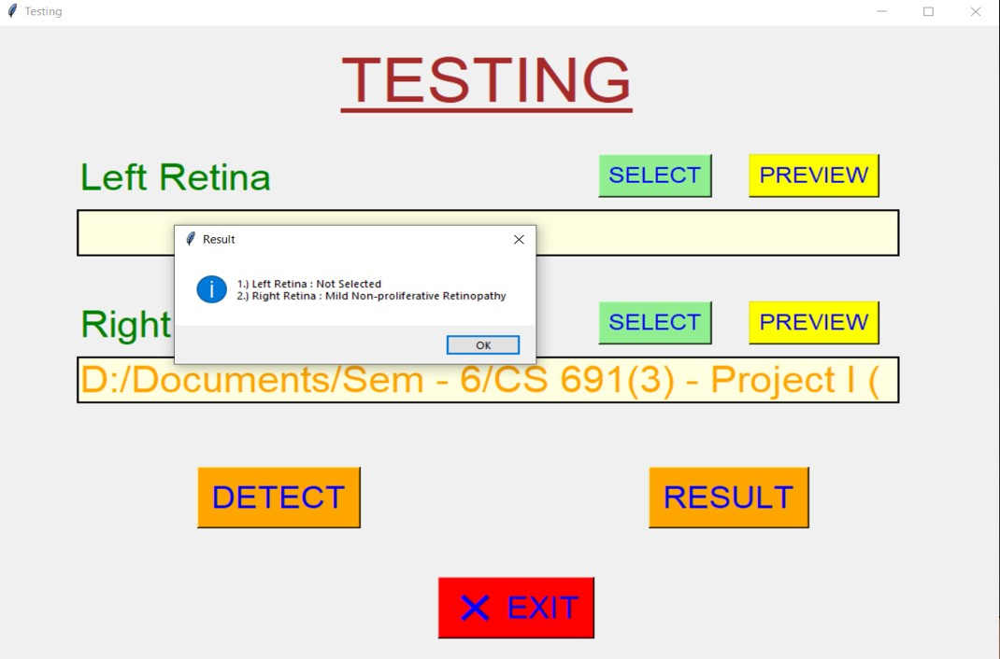

## ✔ Diabetic Retinopathy Detection
- Diabetic retinopathy is a condition suffered by people who have diabeties, which leads to permenent blindness if not treated in time.
- So, we proposed a novel and efficient method to diagnose retinopathy from retinal fundas images using SVM and KNN algorithms.
- This is a python based model for detection of Diabetic Retionpathy and its types.
- In this application user needs to get the fundus images of the retina and using that user will be able to detect if patient has DR and its types(if DR is there).

****

### REQUIREMENTS :
- python 3
- skimage
- sklearn
- scipy
- math
- numpy
- matplotlib
- numpy
- opencv
- pandas
- pywt

****

### HOW TO Use it :
- User just need to download the file, and run the Diabetic_retinopathy_detection.ipynb on local system.
- After that, the model will start with a animation.
- After animation, a GUI window will open and its says model is being trained already.
- then one can test the model using the fundus retina image of the patient.
- Also, user will be able to detect the types of the DR which is present in the patient.

### Purpose :
- This scripts helps user to predict whether patient is having DR or not in a simple user friendly model.

### Compilation Steps :
- Install all the necessary library
- After that download the code file, and run Diabetic_retinopathy_detection.ipynb on local system.
- Then the script will start running and user can explore it by taking different patient retina fundus image and detect DR in it.

****

### SCREENSHOTS :

   
   
   
   
   

****